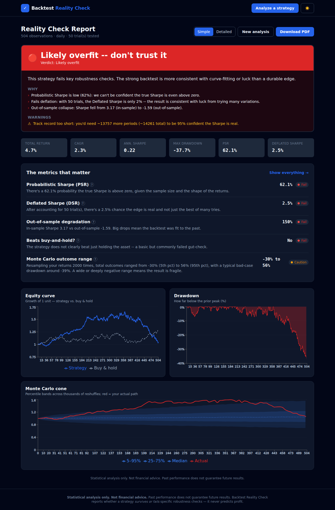

# Backtest Reality Check

**A website where a trader pastes their backtest results and gets an honest,
statistical verdict on whether the strategy is _likely overfit_ or _holds up_ —
with the underlying numbers and plain-English explanations.**

Most retail/algo backtests look amazing and then lose money live because they're
overfit (curve-fit to the past, or cherry-picked from many trials). There are
established statistical methods to detect this _before_ going live. Most traders
don't know they exist. This tool runs them automatically.

> **Brand = honesty.** The tool never says "this will be profitable." It says a
> strategy **survives** or **fails** specific robustness checks. That's the
> entire point.



---

## What it checks

| Check | What it catches |
|---|---|
| **Probabilistic Sharpe Ratio (PSR)** | Whether the Sharpe is real given track-record length, skew & fat tails |
| **Deflated Sharpe Ratio (DSR)** | Data-mining — the "best of N trials" is mostly luck |
| **Minimum Track Record Length** | Track records too short to trust |
| **Haircut Sharpe (Harvey–Liu)** | Multiple-testing adjustment (Bonferroni) |
| **In/out-of-sample degradation** | Curve-fitting (great in-sample, dies out-of-sample) |
| **Probability of Backtest Overfitting (PBO)** | Edge that doesn't generalise across sub-periods |
| **Monte Carlo (bootstrap)** | Fragile results / dependence on a few lucky periods |
| **Buy-and-hold benchmark** | Strategies that don't beat just holding |
| **Distribution diagnostics** | Skew, fat tails, autocorrelation → autocorrelation-adjusted Sharpe |

All signals combine into a single 🟢 / 🟡 / 🔴 **traffic-light verdict** with a
plain-English summary, the top reasons, and specific warnings.

> The Sharpe-family stats (PSR, DSR, MinTRL) use the **per-period
> (non-annualized) Sharpe ratio**; the annualized Sharpe is for display only.

---

## Tech stack

- **Backend:** Python 3.11, FastAPI, uvicorn; `numpy`, `pandas`, `scipy`,
  `statsmodels`; PDF via `reportlab` + `matplotlib`.
- **Frontend:** React + Vite + TailwindCSS, charts with Recharts. Dark mode by
  default, light mode supported. Mobile-responsive.
- **Single-deploy friendly:** FastAPI serves the built React app, so the whole
  thing runs as one service.
- **Pure engine:** all validation math lives in `backend/engine/` with **no web
  dependencies**, fully unit-tested.

---

## Repo structure

```
.
├── backend/
│   ├── main.py            # FastAPI app + routes + serves the SPA
│   ├── analysis.py        # orchestrates the engine, builds chart data + explanations
│   ├── parsing.py         # CSV/paste parsing, validation, normalization
│   ├── report.py          # PDF generation (charts via matplotlib)
│   ├── sample_data.py     # built-in overfit + robust datasets
│   ├── engine/            # PURE python, no web deps
│   │   ├── stats.py           # performance stats (6a)
│   │   ├── distribution.py    # skew, kurtosis, normality, autocorrelation (6b)
│   │   ├── sharpe.py          # PSR, DSR, MinTRL, haircut Sharpe (6c)
│   │   ├── overfit.py         # in/out-of-sample split + single-series PBO (6d)
│   │   ├── montecarlo.py      # bootstrap / reshuffle simulations (6e)
│   │   ├── benchmark.py       # buy-and-hold comparison (6f)
│   │   └── verdict.py         # combines signals -> traffic-light verdict (6g)
│   ├── tests/             # engine unit tests (math verified vs hand-checked values)
│   └── requirements.txt
├── frontend/
│   ├── src/
│   │   ├── pages/         # Landing, Analyze, Results
│   │   ├── components/    # VerdictCard, MetricRow, Tooltip, charts/
│   │   └── lib/           # api.js, store.jsx, format.js
│   └── (vite + tailwind config)
├── Makefile · Procfile · render.yaml
└── README.md
```

---

## Quick start

### Prerequisites
- Python 3.11+
- Node 18+

### Install
```bash
make install
# or manually:
#   python3 -m venv .venv && . .venv/bin/activate
#   pip install -r backend/requirements.txt
#   cd frontend && npm install
```

### Run in development (two terminals)
```bash
make backend     # FastAPI on http://127.0.0.1:8000
make frontend    # Vite on  http://127.0.0.1:5173  (proxies /api -> :8000)
```
Open **http://127.0.0.1:5173** and click **“Try with sample data.”**

### Run as a single service (production-style)
```bash
make run         # builds the frontend, then serves everything on :8000
```
Open **http://127.0.0.1:8000**.

### Run the tests
```bash
make test
```
The engine tests pin PSR / DSR / MinTRL against hand-checked numeric values and
assert the sample datasets produce the expected 🔴 / 🟢 verdicts.

---

## Deploy

The app is one service. On **Render**, the included `render.yaml` builds the
frontend and starts FastAPI. On **Railway / Fly / Heroku-style** platforms, the
`Procfile` works once the frontend is built (`cd frontend && npm run build`).

Generic recipe:
```bash
pip install -r backend/requirements.txt
cd frontend && npm ci && npm run build
cd ../backend && uvicorn main:app --host 0.0.0.0 --port $PORT
```

---

## API

| Endpoint | Description |
|---|---|
| `POST /api/analyze` | Body: data (`data` text **or** `returns[]`) + params (`frequency`, `value_type`, `num_trials`, `confidence`, optional `benchmark`). Returns full JSON: metrics, chart data, verdict, per-metric explanations. |
| `POST /api/report` | Body: `{ "analysis": <result from /api/analyze> }`. Returns a PDF. |
| `GET /api/sample?name=overfit\|robust` | A sample dataset + a full analysis (powers “Try sample data”). |
| `GET /api/samples` | Lists the built-in samples. |
| `GET /api/health` | Health check. |

Example:
```bash
curl -s localhost:8000/api/analyze -H 'Content-Type: application/json' -d '{
  "data": "return\n0.012\n-0.004\n0.008\n0.021\n-0.015",
  "frequency": "daily", "value_type": "auto", "num_trials": 20
}'
```

### Input handling
- Accepts **returns series** or **equity curves** (equity → returns internally).
- Auto-detects **percentage vs decimal** (e.g. `2.5` → 2.5%), overridable.
- Handles **trade-level P&L** as well as time-series returns.
- Handles headers, dates, extra columns, NaN/Inf, and malformed CSV with clear
  errors. Warns below ~30 observations and flags suspicious data (constant
  returns, never-loses).

---

## Sample data

Two built-in datasets let you see both verdicts instantly:
- **Overfit EA** — gorgeous in-sample, collapses out-of-sample, “found” after 50
  trials → **🔴 Likely overfit.**
- **Robust trend filter** — consistent across both halves, few trials, beats
  buy-and-hold → **🟢 Holds up so far.**

---

## Methodology notes

- **DSR variance:** the Deflated Sharpe ideally uses the variance of Sharpe
  ratios across *all* trials you ran. Since the tool only sees one strategy, when
  that set is unavailable it estimates the variance conservatively from the
  strategy's own Sharpe sampling variance — documented in the UI and the
  `engine/sharpe.py` docstring.
- **PBO:** full CSCV needs a matrix of many candidate strategies. For a single
  uploaded series we ship a clearly-labelled single-series approximation
  (how often an in-sample edge disappears out-of-sample across combinatorial
  sub-period splits). The exact split-sample degradation is also reported.
- **Monte Carlo:** bootstrap (resample with replacement) is the default so the
  outcome distribution and percentile are meaningful — a pure reshuffle leaves
  the compounded final return unchanged.

---

## Tiering (monetization hooks)

Tiering is **enforced server-side** — the browser sends a license *key*, never a
tier, and the server decides Pro vs Free by verifying the key.

- **Free:** verdict (full, with reasons), basic stats, drawdown, equity,
  benchmark, PSR, in/out-of-sample, distribution.
- **Pro:** Deflated Sharpe, PBO, haircut, Monte Carlo (sim + cone chart), and
  the downloadable PDF report.

### How it works
1. **License keys** (`licensing.py`) — stateless, HMAC-signed tokens
   (`brc_<payload>.<sig>`). No database: the server verifies the signature and
   expiry. Keys can be time-limited and revoked.
2. **Payments** (`payments.py`) — `/api/webhooks/lemonsqueezy` and
   `/api/webhooks/stripe` verify the provider's signature, then mint a key on a
   paid order. (Lemon Squeezy is recommended — it's merchant-of-record and
   handles sales tax.)
3. **Enforcement** — `/api/analyze` redacts Pro fields for free users;
   `/api/report` returns **402** without a valid key. The frontend shows lock
   cards + an unlock modal (buy link + "enter your key").

### Setup checklist (payments)
1. Set a strong `LICENSE_SECRET` (see `.env.example`).
2. Create a product in **Lemon Squeezy** (or **Stripe**); put the hosted
   checkout link in `CHECKOUT_URL` and a `PRICE_LABEL`.
3. Add a webhook pointing at `/api/webhooks/lemonsqueezy` (or `/stripe`) and set
   `LEMONSQUEEZY_WEBHOOK_SECRET` (or `STRIPE_WEBHOOK_SECRET`).
4. On purchase, the webhook mints a signed key — wire email delivery in
   `payments.fulfill_purchase` (marked `TODO(email)`).
5. For comps/testing, set `ADMIN_TOKEN` and `POST /api/license/issue` with the
   `X-Admin-Token` header, or list literal keys in `LICENSE_KEYS`.

**Still TODO (left clean):** transactional email of the key, user accounts +
saved history, and multiple-strategy management.

### Endpoints (licensing)
| Endpoint | Purpose |
|---|---|
| `GET /api/config` | Checkout link + paid-feature list for the UI. |
| `POST /api/license/verify` | `{key}` → `{valid, tier, expires}`. |
| `POST /api/license/issue` | Admin-only (`X-Admin-Token`) manual key minting. |
| `POST /api/webhooks/lemonsqueezy` · `POST /api/webhooks/stripe` | Verified purchase → mint key. |

---

## Disclaimer

**Statistical analysis only. Not financial advice. Past performance does not
guarantee future results.** This tool reports whether a strategy *survives or
fails* specific robustness checks — it never predicts profit.
